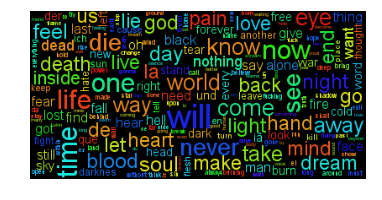

Analyzing Metal Lyrics: Which Band is Most Brutal?
====
For a little while now, I have been wanting to apply fancy data analysis methods to heavy metal lyrics. Most metal lyrics have a very specific focus on some topic not usually considered in songs you might hear on the radio (_e.g.,_ fantasy, rebellion, violence, or blasphemy).

->  <-

Websites like [DarkLyrics](http://www.darklyrics.com) and [The Metal Archives: Encyclopaedia Metallum](http://www.metal-archives.com) have lyrics from thousands of artists and even more thousands of albums. "Extreme" subgenres (like Death or Black metal) have existed for 30 years, meaning there have been tons and tons of bands writing really crazy (awesome) stuff.

Well, the wait is over! Over the past few days, I put together a simple web scraper and downloaded millions of words' worth of lyrics from thousands of bands. The final count for this post includes 17.2 million words from 7,000 bands and 23,000 albums. It's not as comprehensive as Metal Archives' list but it's pretty good for a start.

And now we can generate rankings for the categories of lyrical content that really matter: **Judas Priest, Highlander, Spooky, Violence, and Blasphemy**. I'll explain a little more about the categories below.

Scoring
----
The metric in this case was simple: 

1. For a given category, hand-pick some key words that are most representative of the themes in that category. 

2. Count the total number of times any of those words appear in a band's lyrics. This will bias towards bands that write long songs or have been around for a long time.

3. Optionally normalize to the total number of words (excluding common words) totaled across all the band's songs. This will emphasize bands that focus more on the themes.

In this post I'll present the total scores first and update it to represent the normalized scores once I've finished debugging.

Categories
=====
Judas Priest
----
The "Judas Priest" category is one of my favorites. With songs like "Painkiller," "Leather Rebel," and "Metal Gods," their lyrical themes include superlatives and strong characters.

Key words in this category include: _leather, hard, iron, fastest, blazing, bullet, thunder, etc._

Top 10 **Judas Priest** bands:

1. Saxon 
2. Manowar 
3. Virgin Steele 
4. Hammerfall 
5. Bathory
6. Running Wild
7. Venom
8. Riot
9. Majesty
10. Accept

Top 10 **Judas Priest** albums:

1. _Steel Meets Steel: 10 Years Of Glory_ by Hammerfall
2. _Hell On Wheels Live_ by Manowar
3. _Prayers Of Steel_ by Avenger
4. _Steelcrusher_ by Hammercult
5. _Heavy Metal Thunder_ by Saxon
6. _Heading For The Top_ by Bullet (Sweden)
7. _Bound By Metal_ by Wizard
8. _Own The Crown_ by Majesty
9. _Hell Is_ by Alice Cooper
10. _Rise Of The Hero_ by Iron Savior

Highlander
-----
The "Highlander" category is a colorful name for describing the most over-the-top power metal themes: battle, glory, and high fantasy. 

Words in this category include: _steel, swords, steeds, lords, honored, majestic, noble, etc._

Top 10 **Highlander** bands:

1. Rhapsody
2. Manowar
3. Majesty
4. Saxon
5. Virgin Steele
6. Kaledon
7. Bal-Sagoth
8. Bathory
9. Sacred Steel
10. Folkearth

Top 10 **Highlander** albums:

1. _Own The Crown_ by Majesty
2. _Blade Of Triumph_ by Iron Fire
3. _King Of Kings_ by Leaves' Eyes
4. _Kings Of The Nordic Twilight_ by Luca Turilli
5. _Bound By Metal_ by Wizard
6. _Dawn Of Victory_ by Rhapsody
7. _The Alliance Of The Kings_ by Ancient Bards
8. _Heavy Metal Thunder_ by Saxon
9. _Starfire Burning Upon The Ice-Veiled Throne Of Ultima Thule_ by Bal-Sagoth
10. _Battle Magic_ by Bal-Sagoth

Spooky
-----
Ah, **Spooky**...what a great category. This one focuses on themes that are supernaturally scary. Perhaps this category is better described by its non-inclusion in the other horror themes of **Violence** and **Blasphemy**. Key words include: _ghosts, ghastly, haunted, castle, basement, cathedral, screaming, etc._

Top 10 **Spooky** bands:

1. Cradle Of Filth
2. Venom
3. Slayer
4. Grave Digger
5. Satan's Host
6. Six Feet Under
7. King Diamond
8. Inkubus Sukkubus
9. W.A.S.P.
10. Mercyful Fate

Top 10 **Spooky** albums:

1. _Cabinet_ by Spawn of Possession
2. _Karmagmassacre_ by Sabbat (Japan)
3. _Feed The Demons_ by Ungrace
4. _Mysteries Of The Ancient Charnel_ by Arcane Grail
5. _Metal Revolution_ by Living Death
6. _Mother Moon_ by Inkubus Sukkubus
7. _Demonic Electronic_ by Bile
8. _Godspeed On The Devil's Thunder_ by Cradle Of Filth
9. _Ghetto Machine_ by Loudness
10. _Bury The Hatchet_ by October 31

Blasphemy
----
This is essentially the Black Metal category. The vocabulary here includes domonology and the occult. Key words: _Satanic, pestilence, Elysium, legion, grimoire, Baal, Azazel, Behemoth, ritualistic, ov, etc._

Top 10 **Blasphemy** bands:

1. Satan's Host
2. Venom
3. Behemoth
4. Mortification
5. Slayer
6. The Project Hate MCMXCIX
7. Cradle of Filth
8. Nunslaughter
9. Sabbat (Japan)
10. Virgin Steele

Top 10 **Blasphemy** albums:

1. _Celebration For The Love of Satan_ by Satan's Host
2. _Hell Destroyer_ by Cage
3. _Eve Of Desecration_ by Ezurate
4. _Bleeding The False_ by Aeon (Sweden)
5. _Symphony Of War_ by Magic Kingdom
6. _The Final Sign Of Evil_ by Sodom
7. _Gloria Diaboli_ by Blackmass
8. _Satanic Armageddon_ by Horncrowned
9. _The Nocturnal Silence_ by Necrophobic
10. _Infernal Satanic Verses_ by Mystic Circle

Violence
-----
Where would metal lyrics be without violence and gore? Here we'd expect trash and death bands to top the list. Key words include: _scream, burning, dying, genocide, pain, merciless, etc._

Top 10 **Violence** bands:

1. Samsas Traum
2. Six Feet Under
3. Slayer
4. Mantus
5. Eisregen
6. Cannibal Corpse
7. Asp
8. Manowar
9. Kreator
10. Schandmaul

Top 10 **Violence** albums:

1. _Decade of Aggression_ by Slayer
2. _Sign of Chaos_ by Cephalectomy
3. _The Greater of Two Evils_ by Anthrax
4. _Slit Throat Andromeda_ by Of Graves And Gods
5. _Silent Screams_ by Halford
6. _Imaginary Sonicscape_ by Sigh
7. _Hell on Wheels Live_ by Manowar
8. _Eternal Death_ by Crown of Thorns
9. _God Hates Us All_ by Slayer
10. _Own The Crown_ by Majesty

**Comments:** I had to exclude the word "die" because of all the German-language lyrics. This was also a problem for "war."

Conclusion
=====
I hope you found this post entertaining and educating. I have some more plans for more un-useless analysis using this data, and I hope to post about it soon. I'll also post the Jupyter notebook for this analysis when I clean it up a bit.
